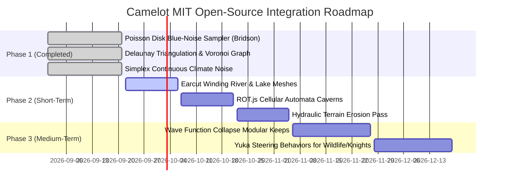

# Open-Source & MIT-Licensed Projects Guide for Camelot

This document provides a curated technical evaluation, integration roadmap, and practical recipes of the top **MIT-licensed** (and compatible permissive CC0/ISC) open-source projects, libraries, and algorithms to empower **Camelot**'s 3D procedural world builder, dungeon synthesis, terrain generation, game AI, and asset pipelines.

---

## 1. Executive Summary & Architectural Fit

Camelot is built on a modern, high-performance web-game stack:
- **Engine**: Babylon.js 8.x + Havok Physics (Wasm) + Recast-Detour NavMesh
- **Language & Tooling**: TypeScript 5.9 + Vite 6 + Vitest
- **Runtime Design**: Headless, deterministically seeded procedural simulation paired with reactive HTML/CSS user interfaces and Babylon 3D scenes.

Choosing **MIT-licensed** (or MIT-compatible ISC / CC0) libraries guarantees:
1. **Unrestricted Permissiveness**: Freedom to modify, bundle, and distribute without copyleft infectivity or commercial encumbrance.
2. **Lightweight & Engine-Agnostic**: Pure mathematical and topological algorithms can run headless in web workers or Node tests without DOM/WebGL overhead.
3. **Zero Royalty / Commercial Safety**: Clean intellectual property provenance for future desktop (Electron/Tauri) or web releases.

---

## 2. Directory of Recommended Projects by Domain

### A. Terrain, Heightfields & Environmental Geometry

| Project | License | NPM / Repo | Value for Camelot |
|---|---|---|---|
| **FastNoiseLite** | MIT | `fastnoise-lite` / [Auburn/FastNoiseLite](https://github.com/Auburn/FastNoiseLite) | Ultra-fast multi-threaded noise: Cellular/Voronoi, Perlin, Simplex, OpenSimplex2, Value, Cubic, Domain Warping, and Fractional Brownian Motion (FBM). Perfect for ridged mountain spires and coastal erosion. |
| **simplex-noise** | MIT | `simplex-noise` (Integrated) | Fast, simplex noise implementation for 2D/3D elevation and climate biome fields. |
| **delaunator** | MIT | `delaunator` (Integrated) | Fast 2D Delaunay triangulation. Powers Camelot's Voronoi province tessellation and inter-settlement road networks. |
| **d3-delaunay** | ISC (MIT-equiv) | `d3-delaunay` | Higher-level Voronoi diagrams, polygon clipping, and centroid relaxation (Lloyd's algorithm) for natural province territory shapes. |
| **earcut** | ISC (MIT-equiv) | `earcut` / [mapbox/earcut](https://github.com/mapbox/earcut) | The fastest polygon triangulation library. Essential for turning 2D lake basins, winding river contours, and province borders into 3D Babylon ground meshes with custom UVs. |
| **poisson-disk** | MIT | `src/world/poisson-disk.ts` (Integrated) | Robert Bridson's $O(N)$ blue-noise sampler. Eliminates prop clumping, guaranteeing natural spacing for trees, resource veins, and ruins. |
| **hydraulic-erosion** | MIT | [dandrino/terrain-erosion-3d-webgl](https://github.com/dandrino/terrain-erosion-3d-webgl) / [weigert/SimpleHydrology](https://github.com/weigert/SimpleHydrology) | Droplet-based particle erosion algorithm. Simulates hydraulic transport and sediment deposition to produce natural river gullies, canyons, and alluvial fans. |

---

### B. Procedural Dungeons, Architecture & Synthesis

| Project | License | NPM / Repo | Value for Camelot |
|---|---|---|---|
| **ROT.js** | MIT | `rot-js` / [ondras/rot.js](https://github.com/ondras/rot.js) | Comprehensive roguelike procedural toolset: Cellular Automata (organic caves), Binary Space Partitioning (bsp room generation), Uniform/Digger mazes, and FOV/Lighting calculations. |
| **WaveFunctionCollapse (WFC)** | MIT | `wave-function-collapse` / [kchapelier/wave-function-collapse](https://github.com/kchapelier/wave-function-collapse) | Constraint-satisfaction bitmap & 3D tile model synthesizer. Assembles modular castle keeps, medieval village street patterns, and multi-story crypts without pattern repetition. |
| **dungeon-generator** | MIT | `dungeon-generator` | Graph-based room-and-corridor generator with cycle detection and doorway constraints for multi-floor barrows. |
| **MarkovJunior** | MIT | [mxgmn/MarkovJunior](https://github.com/mxgmn/MarkovJunior) | Probabilistic rewrite-rule engine based on Markov algorithms. Incredible for generative settlement layouts and street road expansion. |

---

### C. Game AI, Steering, Pathfinding & Decision Making

| Project | License | NPM / Repo | Value for Camelot |
|---|---|---|---|
| **Yuka** | MIT | `yuka` / [Mugen87/yuka](https://github.com/Mugen87/yuka) | Headless JavaScript game AI engine: Autonomous steering behaviors (seek, flee, arrive, pursuit, evade, wander, obstacle avoidance, flocking), spatial indexing, and corridor path smoothing. |
| **mistreevous** | MIT | `mistreevous` (Integrated) | High-performance behavior tree library for NPC decision-making, stealth awareness, and combat states. |
| **xstate** | MIT | `xstate` (Integrated) | Finite state machines and statecharts for NPC lifecycle, daily schedules, and dialogue state management. |
| **ngraph.path** / **pathfinding** | MIT | `ngraph.path` / `pathfinding` | Headless A*, Dijkstra, and Bi-directional search over topological graphs. Ideal for global trade routes, fast-travel cost calculations, and army movements across provinces. |

---

### D. 3D Formats, Mesh Processing & Asset Kits

| Project | License | Source / Repo | Value for Camelot |
|---|---|---|---|
| **Quaternius Assets** | CC0 (Public Domain) | [quaternius.com](https://quaternius.com/) (Integrated) | Stylized low-poly Arthurian/fantasy characters, monsters, modular nature props, and rigged animations. |
| **Kenney Assets** | CC0 (Public Domain) | [kenney.nl](https://kenney.nl/) | Modular medieval castle kits, dungeon kits, weapons, and UI audio assets. |
| **3d-tiles-renderer** | Apache 2.0 / MIT | `3d-tiles-renderer` (Integrated) | Hierarchical Level of Detail (HLOD) 3D tiles for rendering massive terrain datasets and sprawling kingdoms. |
| **gltf-pipeline** | Apache 2.0 / MIT | `gltf-pipeline` | Optimizes and compresses GLB/glTF files with Draco mesh compression and texture resizing, shrinking bundle size by 60–80%. |

---

## 3. Practical Integration Recipes for Camelot

### Recipe 1: Blue-Noise Prop & Resource Scattering (Bridson's Algorithm)

Uniform random distribution (`Math.random()`) suffers from "Poisson clumping", where trees overlap and leave unnatural empty patches. 
Camelot now includes a zero-dependency implementation of Robert Bridson's algorithm in `src/world/poisson-disk.ts`:

```ts
import { generatePoissonPoints, createMulberry32 } from "./world/poisson-disk";

// Generate mineral deposits across a 15x15 chunk province
const rng = createMulberry32(worldSeedNumber);
const resourcePoints = generatePoissonPoints(
  { minX: -7, minY: -7, maxX: 7, maxY: 7 },
  1.8, // Minimum 1.8 chunks distance between veins
  {
    prng: rng,
    k: 30,
    densityFilter: (cx, cz) => {
      // Suppress veins in water or low-danger valleys
      const elev = world.getElevation(cx, cz);
      return elev > 0.4 ? 1.0 : 0.2;
    }
  }
);
```

### Recipe 2: Organic Cave & Catacomb Generation with `ROT.js`

For Arthurian crypts, ancient mines, and cavern barrows:

```ts
import ROT from "rot-js";

export function generateCavernBarrow(width = 40, height = 40, iterations = 4) {
  const map = new ROT.Map.Cellular(width, height, { connected: true });
  map.randomize(0.48); // 48% initial solid rock

  for (let i = 0; i < iterations; i++) {
    map.create();
  }

  // Connect isolated chambers into a unified dungeon network
  map.connect(null, 1);

  const grid: number[][] = [];
  map.create((x, y, value) => {
    if (!grid[y]) grid[y] = [];
    grid[y][x] = value; // 0 = floor/corridor, 1 = cave wall
  });

  return grid;
}
```

### Recipe 3: Procedural Castle Keeps & Town Alleys via WFC

Using Wave Function Collapse for modular architectural synthesis:

```ts
import { SimpleTiledModel } from "wave-function-collapse";

// Define 3D tile socket adjacency rules:
// - wall_straight connects to wall_corner or wall_gate
// - courtyard connects to cobblestone_path or fountain
const wfcModel = new SimpleTiledModel(ruleData, "castle_keep", 16, 16, false);
const success = wfcModel.generate(seedNumber);

if (success) {
  const tileGrid = wfcModel.graphics(); // 2D array of tile IDs
  // Spawn modular meshes from Kenney Castle Kit into Babylon scene
}
```

### Recipe 4: Particle-Based Hydraulic Erosion Pass

Simulating rainwater eroding soft soil on Simplex terrain:

```ts
export function erodeHeightfield(
  elevationMap: Float32Array,
  width: number,
  height: number,
  droplets = 25000,
  inertia = 0.05,
  sedimentCapacity = 4.0,
  minSlope = 0.01
) {
  for (let d = 0; d < droplets; d++) {
    let posX = Math.random() * (width - 1);
    let posZ = Math.random() * (height - 1);
    let dirX = 0, dirZ = 0;
    let speed = 1.0;
    let water = 1.0;
    let sediment = 0.0;

    for (let step = 0; step < 30; step++) {
      const ix = Math.floor(posX);
      const iz = Math.floor(posZ);
      // Compute surface normal gradient
      const gradX = elevationMap[iz * width + (ix + 1)] - elevationMap[iz * width + ix];
      const gradZ = elevationMap[(iz + 1) * width + ix] - elevationMap[iz * width + ix];

      // Update droplet direction with inertia
      dirX = dirX * inertia - gradX * (1 - inertia);
      dirZ = dirZ * inertia - gradZ * (1 - inertia);
      const len = Math.hypot(dirX, dirZ);
      if (len === 0) break;
      dirX /= len;
      dirZ /= len;

      posX += dirX;
      posZ += dirZ;
      if (posX < 0 || posX >= width - 1 || posZ < 0 || posZ >= height - 1) break;

      // Erode or deposit sediment based on capacity vs slope
      const capacity = Math.max(-gradX * dirX - gradZ * dirZ, minSlope) * speed * water * sedimentCapacity;
      if (sediment > capacity) {
        const deposit = (sediment - capacity) * 0.3;
        sediment -= deposit;
        elevationMap[iz * width + ix] += deposit;
      } else {
        const erode = Math.min((capacity - sediment) * 0.3, 0.05);
        sediment += erode;
        elevationMap[iz * width + ix] -= erode;
      }
      speed = Math.sqrt(speed * speed + Math.max(0, -gradX * dirX - gradZ * dirZ) * 9.8);
      water *= 0.98; // Evaporation
    }
  }
}
```

---

## 4. Phased Integration Roadmap for Camelot



### Phase 1: High-Fidelity Scattering & Partitioning (Delivered)
- **Delivered**: `src/world/poisson-disk.ts` integrated into `WorldBuilderSystem` to space mineral veins and botanical nodes with zero clumping.
- **Delivered**: `delaunator` powering province territories and road connections.
- **Delivered**: `simplex-noise` powering continuous elevation, moisture, and temperature biome maps.

### Phase 2: Mesh Triangulation & Organic Dungeons (Next Priority)
1. **`earcut` Integration**: Generate dynamic ribbon river meshes and polygon lake water planes directly from `RiverNetworkGenerator` waypoints with proper vertex normals and water shaders.
2. **`rot-js` Integration**: Enrich `DungeonGenerator` with cellular automata barrow caves, ancient catacomb mazes, and room connectivity validation.
3. **Hydraulic Erosion Worker**: Add an optional "Erosion" toggle in `WorldBuilderUI` that runs a 20,000-droplet particle pass over the heightmap before generating 3D chunk meshes.

### Phase 3: Architectural Synthesis & Squad Steering
1. **Wave Function Collapse (WFC)**: Procedurally generate Camelot's urban settlements, tavern interiors, and castle battlements from modular kits.
2. **Yuka Steering Formations**: Implement flocking and patrol formations for King Arthur's knights, caravan escorts, and wilderness wildlife packs.

---

## 5. Compliance & Attribution Reference

All projects referenced in this guide are licensed under the **MIT License**, **ISC License**, or **CC0 1.0 Universal Public Domain**. 

When distributing releases of Camelot, include standard third-party attribution in `THIRD_PARTY_LICENSES.md` preserving copyright notices:
- `simplex-noise` (c) Jonas Wagner (MIT)
- `delaunator` (c) Mapbox (ISC)
- `recast-detour` (c) Mikko Mononen (Zlib)
- `3d-tiles-renderer` (c) NASA / Garrett Johnson (Apache 2.0)
- `Quaternius Assets` (c) Quaternius (CC0 1.0)
- `Kenney Assets` (c) Kenney (CC0 1.0)
- `Poisson Disk Implementation` based on Robert Bridson (2007)
